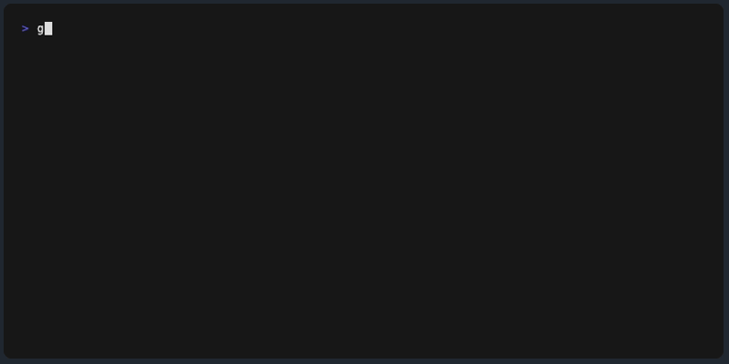

# my-scripts

🔨 My utility Bash scripts

## Installation

```bash
cd ~/projects/ # or any workspace what you use
git clone git@github.com:piecioshka/my-scripts.git

# Bash: please add to `~/.bash_profile`
export PATH="$HOME/projects/my-scripts/bin/:$PATH"

# Fish: please add to `~/.config/fish/config.fish`
set -gx PATH $HOME/projects/my-scripts/bin/ $PATH
```

**TIP**: After changing the shell configuration, restart the terminal to apply the new settings.

## Commands

- `cursor-status-on-macos` - Identify installed version of VSCode and Cursor AI
- `group-images-by-exif-tag` — Group images by EXIF tag value (e.g., FocalLength, ISO, etc., requires `exiftool`)
- `kill-port <port>` — Kill process running on port
- `new-cli-app <name>` — Create new CLI app
- `new-guide <name>` — Create new guide
- `new-macos-app <name>` — Create new macOS app
- `new-project <name>` — Create new project
- `new-react-app <name>` — Create new React app
- `new-slides <name>` — Create new slides
- `npm-release-package` — Release package to npm registry + Push tags to origin + Synchronize with GitHub
- `run-on-each-dir` — Run command on each directory
- `run-x-times` — Run command x times
- `self-destruct` — Remove all files from current directory
- `untar-all-files-in-dir` — Untar all files in directory
- `what-happened` — Display last changes in current directory

## Demos

Recorded with [vhs](https://github.com/charmbracelet/vhs).

### `group-images-by-exif-tag`

```bash
group-images-by-exif-tag FocalLength
group-images-by-exif-tag Aperture
```


