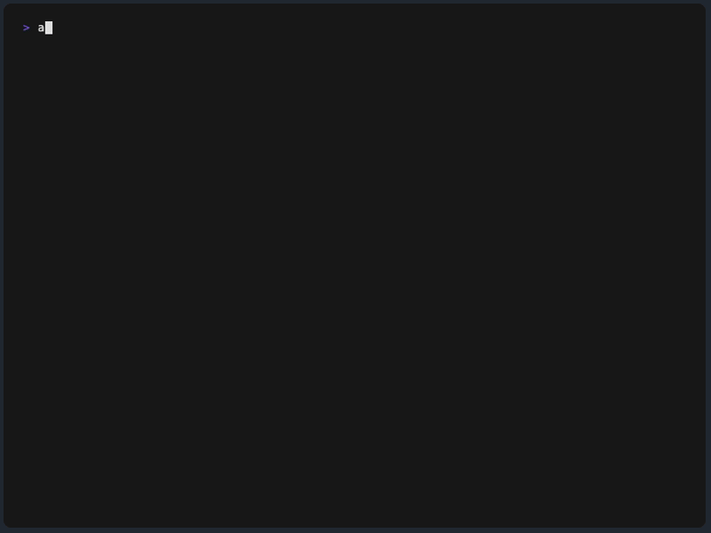
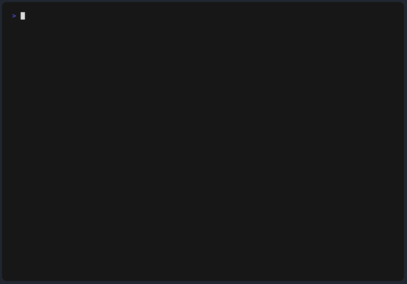
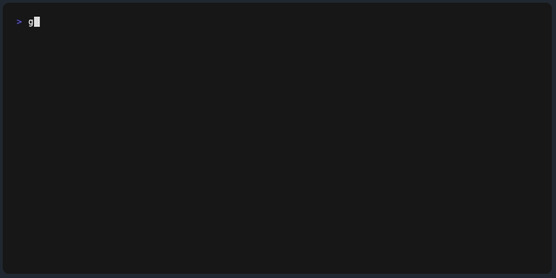
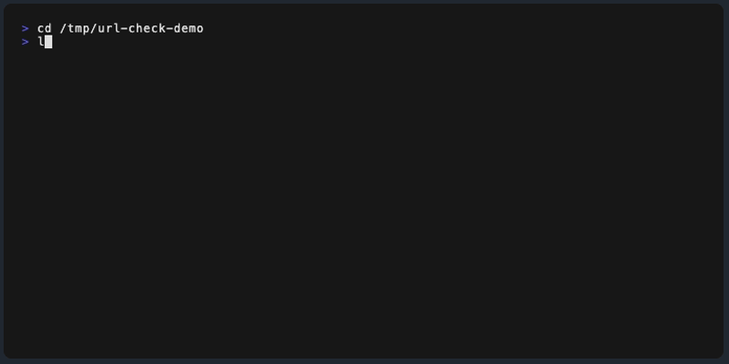

# my-scripts

🔨 My utility Bash scripts

## Installation

```bash
cd ~/projects/ # or any workspace what you use
git clone git@github.com:piecioshka/my-scripts.git

# Bash: please add to `~/.bash_profile`
export PATH="$HOME/projects/my-scripts/bin/:$PATH"

# Fish: please add to `~/.config/fish/config.fish`
set -gx PATH $HOME/projects/my-scripts/bin/ $PATH
```

**TIP**: After changing the shell configuration, restart the terminal to apply the new settings.

## Commands

### AI & Inspection

- `agents` - Identify installed AI agents
- `cursor-status-on-macos` - Identify installed version of VSCode and Cursor AI
- `what-happened` — Display last changes in current directory

### Scaffolding

- `new-guide <name>` — Create new guide
- `new-macos-app <name>` — Create new macOS app
- `new-project <name>` — Create new project
- `new-react-app <name>` — Create new React app
- `new-slides <name>` — Create new slides

### Automation & Workflow

- `npm-release-package` — Release package to npm registry + Push tags to origin + Synchronize with GitHub
- `orphan-files-report` — Run [`orphan-files`](https://github.com/piecioshka/orphan-files) on every subdirectory and aggregate the results into one workspace report as a PDF (`--md` / `--json` keep those formats too)
- `run-on-each-dir` — Run command on each directory
- `run-x-times` — Run command x times

### File & System

- `disk-cleanup` — Free up disk space by clearing caches (npm, brew, docker, yarn/pnpm/bun, system & dev caches, and `node_modules` / `.next` under `~/projects*`); dry-run by default, `--force` to delete, `--group <pkg\|js\|macos\|dev\|node\|next>` to analyze one group
- `group-images-by-exif-tag` — Group images by EXIF tag value (e.g., FocalLength, ISO, etc., requires `exiftool`)
- `kill-port <port>` — Kill process running on port
- `self-destruct` — Remove all files from current directory
- `untar-all-files-in-dir` — Untar all files in directory
- `url-check` — Check whether URLs from a file or stdin respond with HTTP 2xx/3xx

## Demos

Recorded with [vhs](https://github.com/charmbracelet/vhs).

### `agents`

```bash
agents
```



### `disk-cleanup`

```bash
disk-cleanup
disk-cleanup --group pkg
```



### `group-images-by-exif-tag`

```bash
group-images-by-exif-tag FocalLength
group-images-by-exif-tag Aperture
```



### `url-check`

```bash
url-check -f links.txt
echo "https://github.com" | url-check
```



#### Recipe: check whether subdomains are alive

[crt.name](https://crt.name) returns subdomains found in Certificate Transparency logs as plain text, one name per line. Add a scheme to each line and pipe it into `url-check`:

```bash
curl -s "https://crt.name/v1/search?apex=example.org" \
  | sed 's|^|https://|' \
  | url-check
```

- `sed 's|^|https://|'` turns bare names into URLs - `url-check` only picks up lines matching `https?://`.
- A `FAIL 000` means the request never completed (DNS does not resolve, connection refused, TLS error, timeout) - that is the usual signal for a dead subdomain.

## Recipes

### `orphan-files-report` — unused files across a whole workspace

`orphan-files` scans a single project. To get one report for every project in a workspace, run the aggregator from the directory holding them:

```bash
cd ~/projects
orphan-files-report --title "projects"
```

The result is `tmp/<timestamp>_orphan-files-report.pdf`: a summary table of every project, per-project lists of unused files, and a section listing the projects that were skipped because they contain no JS/TS. Paths in the report are absolute, so it still says where it looked once the file is moved elsewhere.

The PDF is built from a Markdown file and the raw JSON data, both discarded once it is rendered. Add `--md` or `--json` to keep them:

```bash
orphan-files-report --md --json
```

Several workspaces at once:

```bash
orphan-files-report ~/projects ~/work --title "all code"
```

The exit code is `1` when at least one project has unused files, so it also works as a check in a larger script.

## License

[The MIT License](https://piecioshka.mit-license.org) @ 2026
